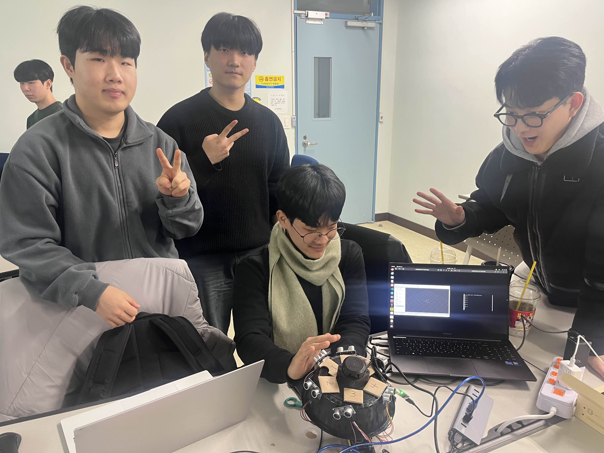

# Perception Team 1
## Member
* 이다빈
* 정가용
* 강민수
* 장동혁
* 한주형




## 느낀점
* 이다빈
  > 이번 프로젝트에서는 카메라 영상을 활용하여 신호등을 인식하는 시스템을 구현하였다. 신호등 인식 과정에서 단일한 방법만 적용하기보다, 데이터 학습 방식을 중심으로 다양한 접근 방법에 대해 팀원들과 자료 탐색과 논의를 진행하였다. 신호등 전체를 하나의 객체로 라벨링해 색상을 분류하는 방법, 실제로 불이 들어오는 영역만을 학습하는 방법, 신호등 자체를 검출한 뒤 HSV 색 공간을 활용해 신호를 판별하는 방법 등 여러 방식을 비교하였다. 이를 통해 팀원들은 상황에 따라 적합한 인식 전략이 달라질 수 있음을 인지할 수 있었다.  
  프로젝트 진행 중 발생한 이슈에 대해서는 팀원들이 각자 문제를 분담하여 토픽 메시지, 노드, 런치 파일 순으로 시스템 구조를 점검하며 디버깅을 진행하였다. 이 과정에서 문제를 큰 단위로 접근하기보다, 구성 요소 단위로 나누어 확인하는 방식이 문제 해결에 효과적임을 확인할 수 있었다.  
  이번 프로젝트를 통해 단순한 물체 인식 구현 뿐만 아니라, 시스템 전체 흐름을 고려한 구조적인 문제 분석의 중요성을 팀 차원에서 공유할 수 있는 계기가 되었다.
* 이기현
  >작년에는 인지팀에서 제공해준 인지 데이터를 받아서 판단/제어만 구현해봤기 때문에, 인지 결과가 어떻게 만들어지는지를 직접 체감할 기회가 거의 없었다. 그런데 이번 프로젝트에서 LiDAR 데이터를 직접 받아 클러스터링을 적용해 보면서, 인지팀이 이전에 배포해주던 장애물 정보가 결국 LaserScan의 수많은 점들을 의미 있는 덩어리로 묶어, 사람이 이해하기 쉬운 형태로 마커로 시각화하고 퍼블리시하는 과정에서 나온 결과라는 걸 실제로 느낄 수 있었다.  
  특히 처음에는 파라미터를 조정하지 않은 상태로 클러스터링을 돌리다 보니, LaserScan 값이 너무 촘촘하게 분리되어 하나의 장애물에 마커가 여러 개 찍히는 현상이 발생했다. 이 상태에서는 장애물 객체 단위 인지가 아니라 단순히 점들이 흩어져 보이는 수준이라, 판단/제어에서 사용하기엔 정보가 불안정하고 신뢰도가 떨어진다는 것을 체감했다. 이후 인접 거리 기준, 최소 클러스터 크기, 거리 필터 등 파라미터를 직접 조정하면서 한 장애물당 한 개의 마커와 ID가 나오도록 안정화했고, 그 결과 RViz 상에서도 장애물이 훨씬 직관적으로 표현되며 장애물 인지라는 목적에 맞는 출력 형태로 개선할 수 있었다. 이 과정을 통해 파라미터 하나가 결과를 얼마나 크게 바꾸는지, 그리고 인지 시스템에서는 데이터를 단순히 뿌리는 것보다 의미 있게 정제하고 일관성 있게 만드는 과정이 얼마나 중요한지 배울 수 있었다.  
  또한 처음에는 espeak-ng로 음성을 출력했지만 로봇톤이 강해 전달력이 떨어지고 사용자 경험이 아쉬웠다. 그래서 클라우드 TTS로 문장을 미리 mp3로 생성해두고, 감지 시 즉시 재생하는 방식으로 바꾸면서 훨씬 자연스럽고 듣기 좋은 AI 목소리를 구현할 수 있었다. 단순히 소리가 난다 수준을 넘어, 실제 시스템처럼 사용자가 듣기 편한 출력 방식까지 고려해 개선해본 점이 의미 있었다.  
  결론적으로 이번 경험은 인지 결과를 받아 쓰는 입장에서 한 단계 더 나아가, 센서 데이터 → 객체화(클러스터링) → 시각화/퍼블리시 → 사용자 알림까지 전체 흐름을 직접 구성해본 경험이었다. 특히 인지 파트의 핵심은 단순히 센서 데이터를 읽는 것이 아니라, 그 데이터를 판단/제어가 신뢰할 수 있도록 객체 단위로 정리하고 안정화하는 과정이라는 것을 몸으로 이해하게 되었고, 앞으로 다른 센서나 더 복잡한 환경에서도 같은 관점으로 확장해볼 수 있다는 자신감이 생겼다.
* 정가용
  > 지난 시간에는 YOLOv8을 통한 실시간 신호등 색 인식, 그리고 오늘은 초음파 및 Lidar 센서 처리에 대해 다루었는데, 전반적인 시스템 및 세부 로직에 관해 이해할 수 있는 시간이었다. 지금까지는 주로 CV 모델 구조에 대해 학습했었는데, 이번 기회를 통해 하나의 application을 다뤄보면서 사회의 요구와 연구의 방향을 맞춰가는 것이 중요함을 체감할 수 있었다.
* 강민수
  >이번 활동에서는 카메라를 이용한 신호등 색상 인식과 초음파 센서 및 LiDAR 센서를 활용한 물체 인지를 주제로 한 두 가지 실습을 수행하였다.  
  첫 번째 활동에서는 YOLO 모델을 활용하여 신호등의 색상을 구별하는 시스템을 구현하였다. 이를 위해 Roboflow를 사용하여 신호등 이미지 라벨링 작업을 진행하였고, 해당 데이터를 Google Colab 환경에서 학습시키는 역할을 담당하였다. 초기에는 약 300장의 학습 데이터를 사용하여 모델을 학습시켰으나, ROS 환경에서 실행한 결과 객체 인식 성능이 충분하지 않아 신호등을 정확히 검출하지 못하는 문제가 발생하였다. 이에 따라 학습 데이터의 수를 약 3000장까지 확장하여 동일한 학습 과정을 다시 수행하였고, 그 결과 ROS 환경에서도 신호등 객체를 안정적으로 인식하고 색상을 판단하는 데 성공하였다. 이후 팀원들이 작성한 코드를 기반으로 실제 학교 주변의 신호등을 인식한 후, 판단된 색상을 TTS(Text-to-Speech)로 출력하는 프로젝트를 성공적으로 수행하였다.  
  두 번째 활동에서는 초음파 센서를 이용하여 물체와의 거리를 측정하고, 이를 통해 물체의 근접 여부를 판단하는 시스템을 구현하였다. PlatformIO IDE를 사용하여 6개의 초음파 센서로부터 거리 값을 수신하는 코드를 작성하였으며, 측정된 데이터를 ROS 상에서 발행(publish)하는 기능을 구현하였다. 이 과정에서 ROS의 발행(Publisher)과 구독(Subscriber) 개념을 실제 코드와 하드웨어 동작을 통해 깊이 있게 이해할 수 있었으며, 전반적인 ROS 통신 구조에 대한 이해도 또한 크게 향상되는 계기가 되었다.
* 장동혁
  >1.2 신호등 인식  
  먼저 image_publisher_node, yolov8node, yolov8_visualizer_node등 각 노드의 기능과 이들이  토픽을 통해 맺는 유기적인 관계를 이해하였다. 이후 usb_cam 패키지로 입력받는 실시간 카메라 영상에 학습된 YOLOv8 모델을 적용하여, 실제 신호등을 인식하고 색상을 구별하는 시스템을 구현하였다. 이 과정에서  캠이 신호등을 인식하지 못하는 시행착오를 겪었으나 학습 데이터량을 늘리는 식으로 YOLO를 재학습시켜 문제를 해결하였다.  
  1.6 라이다  
  PlatformIO를 활용하여 아두이노에서 6개의 초음파 센서 데이터를 처리하고 이를 시리얼 통신으로 ROS 2 환경에 연동하는 시스템을 구축하였다. 초기 설계 과정에서는 C++ 기반 빌드 시스템(ament_cmake)을 사용하는 rplidar_ros 패키지에 Python 노드를 직접 삽입하려다 빌드 시스템 간의 호환성 오류를 직면하였다. 이를 해결하기 위해 Python 전용 패키지를 별도로 생성하여 노드를 재구성하였으며, 이 과정에서 CMake와 setuptools의 구동 원리 차이 및 ROS 2 패키지 구조의 개념을 바로잡았다.  
  터미널을 통해 실시간으로 6개 센서의 거리 값이 정확하게 수신되는 것을 보며, 하드웨어와 소프트웨어 간의 메시지 통신 구조를 명확히 파악할 수 있었다.

* 한주형
    ```md
    ## 느낀점 - 신호등 인식 + 음성 출력 파이프라인

    이번 작업은 단순히 “YOLO로 신호등을 잡는다”에서 끝나는 것이 아니라, 카메라 퍼블리싱 → 인식 → 시각화 → 상태 토픽 변환(Bool) → 음성 재생까지 하나의 ROS2 파이프라인으로 묶는 과정이었습니다.  
    각 단계가 독립적으로는 간단했지만 실제로는 토픽/메시지 타입/QoS/인코딩/빌드 시스템 같은 요소들이 서로 맞물리면서 예상치 못한 문제가 연쇄적으로 발생했습니다. 결과적으로 딥러닝 모델 성능도 중요했지만 ROS2 시스템 통합 관점의 디버깅 능력 또한 중요하다는 것을 크게 체감했습니다.

    ---

    ### 1) 가장 많이 시간을 잡아먹은 문제: Image encoding 불일치

    YOLO 노드에서 `CvBridge.imgmsg_to_cv2(..., desired_encoding="bgr8")`로 이미지를 변환할 때, `/image_raw`에 실려오는 메시지의 `encoding`이 `bgr8`로 명확히 설정되어 있지 않으면 변환 단계에서 예외가 발생했습니다.  
    실제로 아래와 같은 오류는 YOLO가 문제가 아니라 카메라 퍼블리셔가 이미지 메시지를 어떤 인코딩으로 발행했는지에서 시작된 문제였습니다.

    - `"[8UC3] is not a color format. but [bgr8] is. The conversion does not make sense"`

    이 경험을 통해 얻은 결론은 명확했습니다.

    - YOLO/시각화 단계로 넘어가기 전에  
    - ImagePublisher에서 `cv2_to_imgmsg(..., encoding='bgr8')`를 명시적으로 설정하는 것이 정석
    - 이미지가 잘 나오지 않는 문제는 대부분 “인식 모델”이 아니라  
    - ROS 메시지 레벨(encoding, frame_id, stamp, QoS)에서 발생
    - 따라서 딥러닝 노드를 디버깅하기 전에  
    - 토픽 메시지 자체를 먼저 검증하는 습관이 필수

    ---

    ### 2) 시각화는 단순하게 시각적으로 보이는 것 이상의 의미가 있었다.

    `yolov8_visualizer_node`를 단순히 박스를 그려주는 용도라고 생각했지만 실제로는 파이프라인의 상태를 검증하는 데 결정적으로 도움이 됐습니다.

    시각화를 통해 다음을 즉시 확인할 수 있었습니다.

    - YOLO 노드가 정상적으로 detection을 publish 하고 있는지
    - detection 메시지의 bbox가 정상 좌표인지
    - `class_name`(색상)이 제대로 들어가 있는지
    - timestamp 동기화(`message_filters`)로 인해 drop이 발생하는지

    특히 `message_filters` 기반 동기화에서는 이미지 토픽과 detections 토픽이 모두 꾸준히 publish되는가가 중요했고, detection이 비어도 publish하는 방식이 오히려 시스템 안정성에 도움이 되었습니다.  
    결국 시각화 노드는 단순 출력이 아니라 전체 파이프라인의 디버깅 장치라는 걸 확실히 체감했습니다.

    ---

    ### 3) “인식 결과 → 음성 출력”은 메시지 타입 설계가 핵심이었다

    처음에는 “visualizer에서 red가 보이니 음성도 나오겠지”라고 생각했지만, 실제로는 바로 이어지지 않았습니다.

    - visualizer는 `DetectionArray`를 소비하지만
    - speaker 노드는 `/red`, `/yellow`, `/green` 같은 `std_msgs/Bool` 토픽을 구독합니다.

    즉, 메시지 타입이 완전히 다릅니다.  
    이 차이를 맞추기 위해 중간에 `traffic_light_bool_bridge.py` 같은 브리지 노드가 필요했고, 결국 이번 구조는 노드 간 계약(Interface)이 얼마나 중요한가를 직접 보여주는 사례가 됐습니다.

    ---

    ### 4) 음성 출력에서 생각보다 중요한 것들: 환경/파일/재생기

    스피커 노드에서는 `pygame.mixer`를 사용했는데, 여기에서도 실제 운영 환경에서 체크해야 할 포인트가 많았습니다.

    - 사운드 파일 경로를 상대경로로 두면 실행 위치에 따라 실패할 수 있음  
    → `get_package_share_directory()` 기반의 절대 경로가 안전
    - headless 환경/원격 실행에서는 오디오 디바이스 문제 가능
    - mp3 파일 존재 여부, 권한, 코덱 문제 등 단순하지만 자주 발생하는 이슈 존재

    특히 “visualizer에서 red가 보이는데 speaker는 조용하다”는 상황은 대부분 아래 원인이었습니다.

    - 토픽이 아예 안 들어오거나
    - 토픽은 들어오는데 Bool 값이 `False`이거나
    - `sound_path`가 틀리거나
    - 재생기 초기화(`mixer.init()`)가 실패하는 경우

    즉, 음성 출력 이슈는 인식 성능과 무관한 시스템 문제인 경우가 많았습니다.

    ---

    ### 5) 전체적으로 얻은 가장 큰 교훈

    이번 프로젝트를 하면서 가장 크게 느낀 점은 한 문장으로 정리됩니다.

    > 인식 정확도보다 “ROS2 통합의 정확도”가 먼저다.

    딥러닝 노드 자체는 비교적 빠르게 동작했지만, 실제 시스템으로 엮는 과정에서

    - 토픽 이름
    - 메시지 타입
    - encoding
    - QoS
    - timestamp
    - `setup.py` / `launch.py` / `install`
    - runtime 환경(오디오)

    같은 요소들이 하나라도 어긋나면 전체 파이프라인이 멈추는 구조였습니다.

    이 과정을 통해, 앞으로는 기능을 붙이기 전에 아래 순서로 검증하는 기준을 세우게 됐습니다.

    1. 토픽이 실제로 publish 되는가 (`ros2 topic list`, `ros2 topic echo`)
    2. 메시지 타입이 기대와 같은가 (`ros2 topic info`)
    3. 메시지 필드(encoding/stamp/frame_id)가 정상인가
    4. 노드 간 인터페이스가 연결되는가 (중간 브리지/변환 포함)
    5. 마지막 출력(시각화/음성)까지 end-to-end로 동작하는가

    ---

    ## 느낀점 - 신호등 인식 + 음성 출력 파이프라인
    
    오늘은 유아차 기반 자율주행 프로젝트에서 초음파 센서 6개와 ROS2 노드를 연동해 “어느 센서가 장애물을 감지했는지”를 음성으로 출력하는 기능을 점검하고 개선했다. 처음에는 소리가 나지 않아 단순히 오디오 문제라고 생각했지만, 실제로는 전체 파이프라인(아두이노 출력 포맷 → 시리얼 수신 → ROS2 토픽 발행 → 스피커 노드 재생) 중 어디에서 끊기는지 명확히 분해해서 확인하는 과정이 더 중요하다는 점을 느꼈다.  

    특히 아두이노가 보내는 데이터 형식과 ROS2 브릿지 노드가 기대하는 형식이 조금만 달라도 시스템은 일부는 동작하는 것처럼 보이지만 결과는 안 나오는 상태가 될 수 있었다. 그래서 단순히 코드를 수정하는 것보다, 각 단계에서 토픽 echo, 수신 로그, 파일 존재 여부, mixer 초기화 상태와 같은 관측 가능한 지표를 만들어 3초마다 상태를 찍도록 한 것이 문제를 좁히는 데 큰 도움이 됐다. 이 과정을 통해 디버깅은 감으로 때우는 작업이 아니라, 가설을 세우고 관측을 통해 하나씩 배제해가는 절차라는 점을 체감했다.  

    또한 “장애물 감지” 자체도 임계값 하나로 끝나는 것이 아니라, 이벤트가 너무 자주 발생해 음성이 겹치지 않도록 쿨다운을 두거나, 여러 센서가 동시에 감지할 때 우선순위를 정하는 등 시스템적으로 설계해야 한다는 것을 배웠다. 오늘 작업을 통해 하드웨어 센싱과 소프트웨어 이벤트 처리 사이의 간극을 줄이는 방법을 익혔고, 앞으로는 기능을 추가하기 전에 데이터 포맷과 상태 로그부터 먼저 표준화해서 개발 효율을 높여야겠다고 생각했다.
    ```